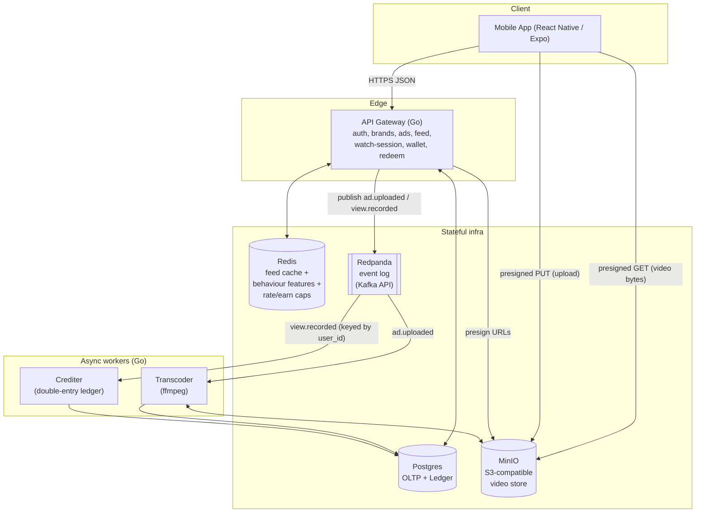
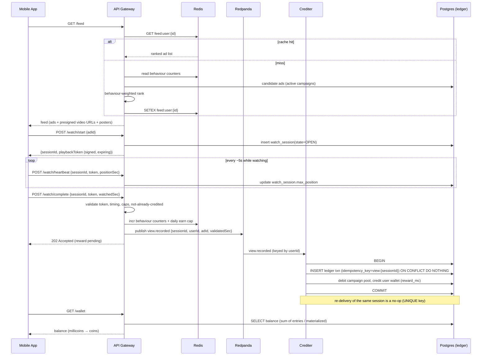

# CoinReels — Architecture

Rewarded short-video ad platform (Meesho-Reels-style). Brands upload short video ads; users watch a
personalized feed and earn platform **coins** (a real-money liability, 1 coin = ₹1) credited through
a **double-entry ledger**; coins are redeemable on-platform. Designed for millions of users; the MVP
in this repo runs the full loop on real infrastructure in Docker.

> Read `RESEARCH.md` for the industry research this design is built on, and `DECISIONS.md` for the
> rationale behind every non-obvious choice (referenced inline as **D2.x**).

---

## 1. Design tenets (the load-bearing rules)

1. **The client is never trusted for money.** Ad completion — the thing that mints coins — is
   decided **server-side** from a signed playback token + heartbeats. (D2.6)
2. **Coins live in an append-only double-entry ledger**, never a mutable balance column. Every credit
   is balanced by a debit; `SUM(all account balances) = 0` is a continuously-checkable invariant. (D2.3)
3. **Payout is derived from funded advertiser revenue, never from wall-clock time.** "1 min = 1 coin"
   is a display abstraction; the real payout is bounded by a campaign's funded budget. (D2.2)
4. **The read-hot path (feed) and the write-heavy path (events) are physically separated.** Feed
   serving is a Redis cache lookup; view events flow through a broker to async workers. Neither
   blocks the other, and neither blocks on ML or on the ledger. (D2.5, D2.11)
5. **Money in integer minor units (millicoins, int64). No floats, ever.** (D2.1)
6. **Exactly-once crediting via deterministic idempotency keys + a UNIQUE constraint.** Delivery is
   at-least-once, so duplicates are assumed and de-duped, not hoped-against. (D2.4)

---

## 2. Capacity targets & SLOs (sizing basis — D2.12)

| Metric | Target |
|---|---|
| Registered users | 10 M |
| Daily active users (DAU) | 1 M |
| Ads watched / user / day | ~20 |
| View-completion events | ~20 M/day ≈ **230/s avg, ~2.5k/s peak** |
| Feed requests | ~3.5k QPS peak (served from Redis, **not** Postgres) |
| Ledger credit writes | ≈ completion rate (~2.5k/s peak) |
| Feed-serve latency SLO | p99 < 50 ms (cache hit) |
| Coin-credit visibility SLO | < 5 s after validated completion (async) |
| Ledger correctness | hard invariant: global balance sum == 0, always |

**Single Postgres primary is sufficient at these write rates** (thousands of small txns/sec is well
within one node). **Sharding trigger:** ledger > ~5k writes/s sustained OR ledger table > ~500 GB →
adopt Citus / partition the ledger by `user_id` range. Until then: one primary + read replicas.

---

## 3. End-to-end flow (ASCII)

```
                                  ┌─────────────────────────────────────────────┐
                                  │                MOBILE APP (Expo)             │
                                  │  Feed ▸ Player ▸ Wallet ▸ Redeem ▸ Brand UI  │
                                  └───────────────┬──────────────────────────────┘
                                                  │ HTTPS (JSON)
                                                  ▼
                       ┌───────────────────────────────────────────────────────────┐
                       │                      API GATEWAY (Go)                       │
                       │  auth · brands · ads(upload) · FEED · watch-session · wallet│
                       │           · redeem      (publishes domain events)           │
                       └─┬─────────┬───────────┬───────────────┬──────────┬──────────┘
       presigned PUT/GET │         │ cache R/W │ feature R/W    │ publish  │ sync ledger txn
                         ▼         ▼           ▼                ▼          ▼ (redeem)
                   ┌─────────┐ ┌────────┐ ┌──────────┐   ┌──────────┐ ┌───────────┐
                   │  MinIO  │ │ Redis  │ │  Redis   │   │ Redpanda │ │ Postgres  │
                   │ (video) │ │ (feed  │ │(behaviour│   │ (events) │ │  (OLTP +  │
                   │         │ │ cache) │ │ counters)│   │          │ │  LEDGER)  │
                   └────▲────┘ └────────┘ └──────────┘   └────┬─────┘ └─────▲─────┘
                        │                                     │             │
          ad.uploaded   │                          view.recorded │ keyed by user_id
                        │                                     │             │
                   ┌────┴───────┐                        ┌─────▼──────┐     │
                   │ TRANSCODER │                        │  CREDITER  │─────┘
                   │  (ffmpeg)  │                        │  (ledger   │  double-entry credit
                   │ probe·post │                        │  consumer) │  (debit pool, credit
                   │ ·faststart │                        │ idempotent │   wallet) exactly-once
                   └────────────┘                        └────────────┘
```

**The money path in one line:** brand funds a campaign (advertiser_funding → campaign pool) →
user watches → server validates the session → `view.recorded` → `crediter` debits the campaign pool
and credits the user wallet (exactly once) → balance query reflects it → user redeems (wallet →
redemption_sink).

---

## 4. C4-ish container diagram (Mermaid)



---

## 5. The view → reward sequence (Mermaid)



## 5b. Brand upload → transcode sequence (Mermaid)

```mermaid
sequenceDiagram
    participant B as Brand (App)
    participant API as API Gateway
    participant OBJ as MinIO
    participant RP as Redpanda
    participant TC as Transcoder
    participant PG as Postgres

    B->>API: POST /brands/{id}/ads (title, category, duration hint)
    API->>PG: insert ad(state=UPLOADING)
    API->>OBJ: presign PUT url
    API-->>B: {adId, uploadUrl}
    B->>OBJ: PUT video bytes (direct, bypasses API)
    B->>API: POST /ads/{id}/complete
    API->>PG: ad.state = PROCESSING
    API->>RP: publish ad.uploaded {adId, objectKey}
    RP->>TC: ad.uploaded
    TC->>OBJ: GET original
    TC->>TC: ffprobe duration; ffmpeg poster.jpg; faststart mp4
    TC->>OBJ: PUT poster + streamable mp4
    TC->>PG: ad.state = READY, set duration_sec, poster_key, stream_key
    Note over TC,PG: ad now eligible for the feed
```

---

## 6. Services

| Service | Lang | Responsibility | Scales by |
|---|---|---|---|
| **api** | Go | Stateless HTTP gateway: auth (JWT), brand & ad CRUD, presigned upload, **feed** (cache-first), **watch-session** lifecycle + server-side validation, wallet read, **redeem** (sync ledger txn). Publishes `ad.uploaded` and `view.recorded`. | horizontal (stateless) |
| **transcoder** | Go + ffmpeg | Consumes `ad.uploaded`; probes duration, makes poster + faststart MP4; marks ad READY. | consumer-group partitions |
| **crediter** | Go | Consumes `view.recorded` (keyed by user_id → per-user ordering); performs the **double-entry credit** idempotently. | consumer-group partitions |
| **migrate** | Go | One-shot: applies embedded SQL migrations under a PG advisory lock. Gate for all others. | n/a |
| **seed** | Go + ffmpeg | One-shot: generates sample clips, uploads to MinIO, inserts demo brands/users/ads, funds campaign pools. | n/a |

All app services share `internal/` packages (`ledger`, `events`, `store`, `objstore`, `auth`,
`feed`, `fraud`). **The `internal/ledger` package is the single implementation of double-entry
correctness** used by both `crediter` (async earn) and `api` (sync redeem) — there is exactly one
place money math lives.

---

## 7. Data model (Postgres)

```
brands(id, name, handle, created_at)
users(id, handle, created_at)
ads(id, brand_id, title, category, state[UPLOADING|PROCESSING|READY|REJECTED],
    duration_sec, object_key, stream_key, poster_key,
    reward_mc,            -- funded full-completion reward (≤ net revenue/completion)
    campaign_id, created_at)
campaigns(id, brand_id, name, funded_mc, created_at)

-- LEDGER (append-only, double-entry) ----------------------------------------
ledger_accounts(id, kind[EXTERNAL|POOL|USER], ref,   -- ref e.g. user_id / campaign_id
                balance_mc BIGINT NOT NULL DEFAULT 0, -- materialized projection
                UNIQUE(kind, ref))
ledger_transactions(id, idempotency_key TEXT UNIQUE NOT NULL, kind, created_at, meta JSONB)
ledger_entries(id, txn_id FK, account_id FK, amount_mc BIGINT NOT NULL,  -- +credit / -debit
               created_at)
   -- invariant per txn: SUM(amount_mc)=0 ; global: SUM(balance_mc over accounts)=0

watch_sessions(id, user_id, ad_id, state[OPEN|COMPLETED|VOID],
               started_at, completed_at, max_position_sec, validated_sec,
               playback_token_hash, ip, credited BOOL)
redemptions(id, user_id, idempotency_key UNIQUE, amount_mc, item, state, created_at)
```

### Ledger mechanics
- A **transaction** is a set of **entries** whose `amount_mc` sums to **0** (double-entry). It is
  written atomically; `ledger_accounts.balance_mc` is updated in the **same** DB transaction (a
  materialized projection so balance reads are O(1)). The entries table is the source of truth; the
  balance column is a cache that can be rebuilt by `SUM(amount_mc) GROUP BY account_id`.
- **Idempotency:** `ledger_transactions.idempotency_key` is `UNIQUE`. The crediter inserts with
  `ON CONFLICT (idempotency_key) DO NOTHING`; if 0 rows inserted, the credit already happened and the
  message is acked without touching balances. Header + entries + balance updates + cap update commit
  in **one** DB transaction, and the Kafka offset is committed **only after** that PG COMMIT — so
  at-least-once delivery becomes exactly-once *effect*, with no partial-write hole.
- **No overdraw, ever:** balance changes are atomic in-place arithmetic. The pool earn-debit takes
  `LEAST(pool_balance, reward)` under a `FOR UPDATE` read (credit only what the pool actually funds →
  a pool can never go negative → no unfunded coins are minted). The wallet redeem-debit is
  conditional `WHERE balance_mc >= :r` (the real double-spend defense — a UNIQUE idempotency key does
  *not* prevent two distinct-key redemptions from overdrawing).
- **Reconciliation is more than sum-to-zero.** `SUM(balance_mc)=0` holds by algebraic identity even
  if a wallet went negative, so it is necessary but **not** a solvency check. The real invariants
  (asserted by the smoke test and exposed at `GET /admin/recon`):
  1. every `USER` and `POOL` account `balance_mc >= 0`;
  2. per-account `balance_mc == SUM(entries.amount_mc)` (projection matches journal);
  3. global `SUM(balance_mc) = 0`;
  4. funding identity: `|advertiser_funding| == ΣPOOL + ΣUSER + redemption_sink`.

### Chart of accounts
| Account | kind | meaning | sign convention |
|---|---|---|---|
| `world/advertiser_funding` | EXTERNAL | money entering from advertisers | goes **negative** (it has paid out into pools) |
| `campaign/{id}` | POOL | funded reward budget for a campaign | positive, drains as users earn |
| `user/{id}` | USER | a user's spendable coin balance | positive |
| `world/redemption_sink` | EXTERNAL | coins removed by redemption | positive (absorbs spent coins) |

Fund campaign: `advertiser_funding −X, campaign +X`. Earn: `campaign −r, user +r`. Redeem:
`user −r, redemption_sink +r`. Every transaction nets to 0 ⇒ the global sum is invariant at 0.

---

## 8. The two hot paths

### Read-hot: feed serving (D2.11)
`GET /feed` → `GET feed:user:{id}` in Redis. **Hit:** return immediately (p99 < 50 ms). **Miss:**
read the user's behaviour counters from Redis (per-category watch & completion counts), pull
candidate READY ads from active campaigns, score with a transparent linear model
`score = base_pacing + Σ wᵢ·affinityᵢ − frequency_penalty`, cache the ranked list with a short TTL,
return. Cold-start users get the **global popularity/pacing list**. The synchronous request **never**
runs heavy ML and **never** touches the broker or ledger. The two-stage candidate→rank *shape* is
preserved so a two-tower retrieval + GBDT/ANN ranker can replace the linear scorer with no API
change.

### Write-heavy: view events (D2.5)
A validated completion publishes one `view.recorded` to Redpanda, **partitioned by `user_id`** (so a
single user's events are ordered and processed by one consumer → no intra-user races). The `crediter`
consumer group scales out across partitions. The user gets a `202` immediately; crediting is async
and visible within the < 5 s SLO. This decouples watch UX latency from ledger write latency and lets
each side scale independently.

---

## 9. Fraud model (MVP-real, server-side — D2.6)

The trust boundary: **a coin is only minted from a watch session the server itself validated.**

1. `POST /watch/start` issues a **playback token** = HMAC-signed `{sessionId, userId, adId, exp}`.
   The token is required to complete; it expires (≈ ad duration + slack).
2. Heartbeats update `max_position_sec`; a completion with no heartbeats / implausible cadence is
   rejected.
3. `POST /watch/complete` validates, in order: token signature & expiry → session OPEN & not already
   credited → `validatedSec ≤ duration_sec` → wall-clock elapsed ≈ `validatedSec` (can't claim 60 s
   of watch in 3 s) → **per-user daily earn cap** (Redis counter) → **per-(user,ad) cooldown**
   (can't farm the same ad). Only then is `view.recorded` emitted. Failing any check returns the
   session as VOID with no event ⇒ no coins.
4. **Exactly-once at the ledger** (idempotency key) is the backstop: even a replayed event credits
   at most once.

**Deferred (designed, not built):** Play Integrity / App Attest device attestation, IP/ASN +
fingerprint graph clustering, ML velocity/anomaly scoring, a **pending→maturation→available** state
machine with clawback aligned to advertiser settlement windows, and KYC/AML tiers gating INR
cash-out. The MVP credits to *available* immediately (hold = 0) so the earn→redeem loop is
observable (D2.7).

---

## 10. Scaling, partitioning, consistency, failure modes

- **Statelessness:** `api` holds no session state (JWT + Redis) → scale horizontally behind an LB.
- **Partitioning:** events partitioned by `user_id`; ledger shards (when needed) by `user_id` range;
  campaign pools are per-campaign rows (the one cross-user write contention point — see below).
- **Idempotency everywhere money moves:** view-credit keyed by session, redeem keyed by client UUID.
- **Consistency boundaries:** feed is eventually consistent (cache TTL); wallet is strongly
  consistent on read (reads the materialized balance) but eventually credited (async). Redeem is
  strongly consistent (single ACID txn) and refuses to overdraw.
- **Failure modes & mitigations:**
  | Failure | Effect | Mitigation |
  |---|---|---|
  | Crediter crashes mid-batch | unacked events | at-least-once redelivery + idempotency ⇒ no double credit, no loss |
  | Duplicate `view.recorded` | — | UNIQUE idempotency key ⇒ no-op |
  | Transcoder fails on a video | ad stuck PROCESSING | retry w/ backoff; after N, mark REJECTED (never feeds) |
  | Redis cache lost | feed cold | recompute from Postgres + behaviour counters; degraded latency, correct results |
  | Campaign pool exhausted | nothing to pay | credit capped at pool balance; ad pacing stops serving it |
  | Postgres failover | brief write pause | sync replica + retries; ledger txns are short |
- **Top bottlenecks:** (1) **campaign-pool row contention** — every earner on a hot campaign must
  take a row lock on that one pool account, capping it at ~hundreds of credits/sec. **Per-user event
  partitioning does NOT fix this** (it serializes a *user*, not the shared pool row). The real fix
  (deferred — seed pools are small) is **K sharded sub-account rows** `campaign/{id}#0..K`, chosen by
  `hash(user_id)%K`, with `balance = SUM(shards)`. (2) **ledger write throughput** — a single primary
  realistically sustains ~2–3k commits/s of these multi-row txns; beyond that, RANGE-partition then
  shard by `user_id`. (3) **video egress** — MVP serves presigned MinIO directly; a CDN in front is a
  hard pre-launch gate, and egress cost must be subtracted from the net-revenue reward cap.

### Event publication & ordering (outbox)
Publishing to Redpanda is **not** atomic with the Postgres state change (dual-write). A crash between
"session COMPLETED" and "event published" would silently lose a paid coin. So the COMPLETED txn writes
a row to an **`outbox`** table in the *same* transaction; an api-side relay goroutine claims rows with
`FOR UPDATE SKIP LOCKED` (safe across api replicas), publishes to Redpanda with `Key=user_id`, and
marks them published. Topics are created up front with a **fixed 12 partitions** (auto-create
disabled); correctness rests on **dedup + idempotency**, not on partition ordering surviving a
rebalance.

### Media URLs (why the feed never embeds presigned URLs)
Presigned URLs are short-lived and can't live in a cached feed blob (they'd 403 when stale). And
SigV4 signs the host, so a URL signed for the in-cluster `minio:9000` is unreachable from a phone or
the host. So: the feed caches only ad IDs + scores + poster/stream **object keys**; the client plays
via `GET /media/{adId}` (and `/media/{adId}/poster`), which **302-redirects** to a freshly-presigned
URL minted with `MINIO_PUBLIC_ENDPOINT` (an externally-reachable host). Bytes still stream directly
from object storage; only the tiny redirect touches the API.

---

## 11. Technology choices & justification

| Concern | Choice | Why (vs alternatives) |
|---|---|---|
| Backend | **Go** | required; great concurrency, static binaries, tiny containers |
| OLTP + ledger | **Postgres** | ACID, `SERIALIZABLE`/`UNIQUE` for money correctness, JSONB, mature; Citus path for later sharding |
| Cache / features / caps | **Redis** | sub-ms reads for the feed hot path; atomic INCR for counters & caps |
| Event spine | **Redpanda** | Kafka API, **single binary, no Zookeeper** → docker-friendly while mirroring a Kafka-at-scale design; per-key ordering |
| Kafka client | **franz-go** | pure Go, no CGo, modern, good consumer-group support |
| Object storage | **MinIO** | S3-compatible, runs in Docker; presigned URLs keep video bytes off the API |
| Transcode | **ffmpeg** | the industry standard; probe + poster + faststart is a real, minimal pipeline |
| Mobile | **React Native + Expo** | Flutter not installed; Node is; Expo runs on device + web preview (verifiable) (D0.3) |
| HTTP | **chi** + stdlib | lightweight router, idiomatic `net/http` |

---

## 12. MVP scope — the single authoritative cut line (D2.x)

**IN (built & must pass the smoke test):**
brand profile + campaign + video upload (presigned) · real ffmpeg transcode (duration/poster/
faststart) · MinIO storage · cache-first **personalized feed** (behaviour-weighted) · watch-session
lifecycle with **signed playback token + heartbeats + server-side completion validation** · earn caps
& cooldowns · `view.recorded` → Redpanda → **double-entry exactly-once credit** · wallet balance ·
**redeem** · auto-migrate + seed · **Expo mobile app** exercising feed→watch→earn→redeem · global
ledger sum-to-zero assertion.

**DEFERRED (designed in this doc, explicitly not built):**
HLS/ABR + real CDN · ML two-tower/ANN ranking · offerwall/auction monetization · device attestation ·
IP/ASN + fingerprint fraud graph · ML anomaly scoring · pending→maturation→available + clawback ·
KYC/AML cash-out tiers · ClickHouse analytics · Citus sharding · multi-region.

> The deferred list is deliberate: each item is real production work with a clear home in this
> architecture, omitted to keep the MVP demonstrable on a laptop — not forgotten.
