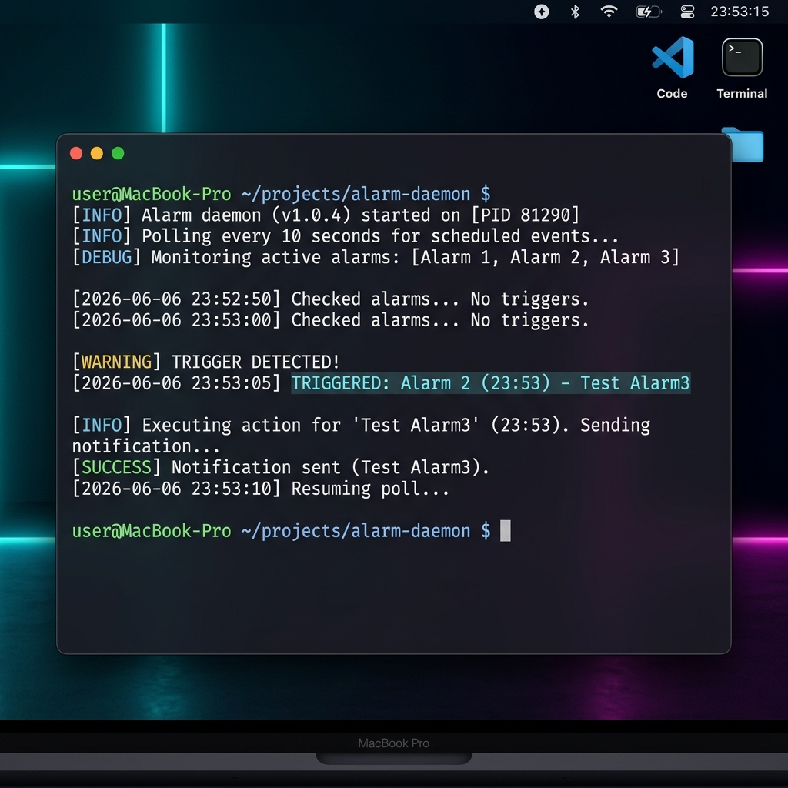

# Alarm Clock CLI

A simple, Python-based Command Line Interface (CLI) alarm clock that uses a JSON file for persistent storage.

## Execution Model

The application operates in a client-daemon model across two terminal sessions:
1. **Daemon Terminal**: Runs the background monitor loop which checks the scheduled alarms every 10 seconds.
2. **Client Terminal**: Used by the user to add, list, and delete alarms.

---

## File Structure & Separation of Concerns

*   **`main.py`**: CLI Entry Point. Parses input arguments and dispatches actions to the manager or runner.
*   **`manager.py`**: Business Logic. Validates time formats, formats alarm listings, and handles coordinate logic between CLI input and storage.
*   **`storage.py`**: Persistence Layer. Reads/writes to `alarms.json` and manages incremental integer IDs.
*   **`runner.py`**: Daemon Loop. Polles `alarms.json` and checks if current time matches scheduled alarms.
*   **`test_alarm.py`**: Unit tests covering storage persistence, time validation, managers, and checking logic.

---

## Function Call Flow Diagram

Here is a visual map of how functions in each module call each other:

```mermaid
graph TD
    %% Main Entry
    subgraph CLI Entry (main.py)
        M[main]
    end

    %% Business Logic
    subgraph Business Logic (manager.py)
        A[add_alarm]
        L[list_alarms]
        D[delete_alarm]
    end

    %% Storage Logic
    subgraph Data Access (storage.py)
        LA[load_alarms]
        SA[save_alarms]
    end

    %% Daemon Logic
    subgraph Alarm Monitor (runner.py)
        R[run_loop]
        C[check_alarms]
    end

    %% Execution Flows
    M -->|add| A
    M -->|list| L
    M -->|delete| D
    M -->|run| R

    A -->|1. Load existing| LA
    A -->|2. Append & Save| SA

    L -->|Load alarms| LA

    D -->|1. Load existing| LA
    D -->|2. Remove & Save| SA

    R -->|1. Load alarms| LA
    R -->|2. Filter| C
```

---

## Usage

*Note: Depending on your system configuration, you may need to use `python3` instead of `python`.*

### 1. Run the Alarm Daemon (Terminal 1)
```bash
python3 main.py run
```

### 2. Manage Alarms (Terminal 2)
- **Add an Alarm** (24-hour format `HH:MM`):
  ```bash
  python3 main.py add 14:30 "Time for gym"
  ```
- **List Alarms**:
  ```bash
  python3 main.py list
  ```
- **Delete an Alarm**:
  ```bash
  python3 main.py delete 1
  ```

### 3. Run Unit Tests
```bash
python3 test_alarm.py
```

---

## Preview



